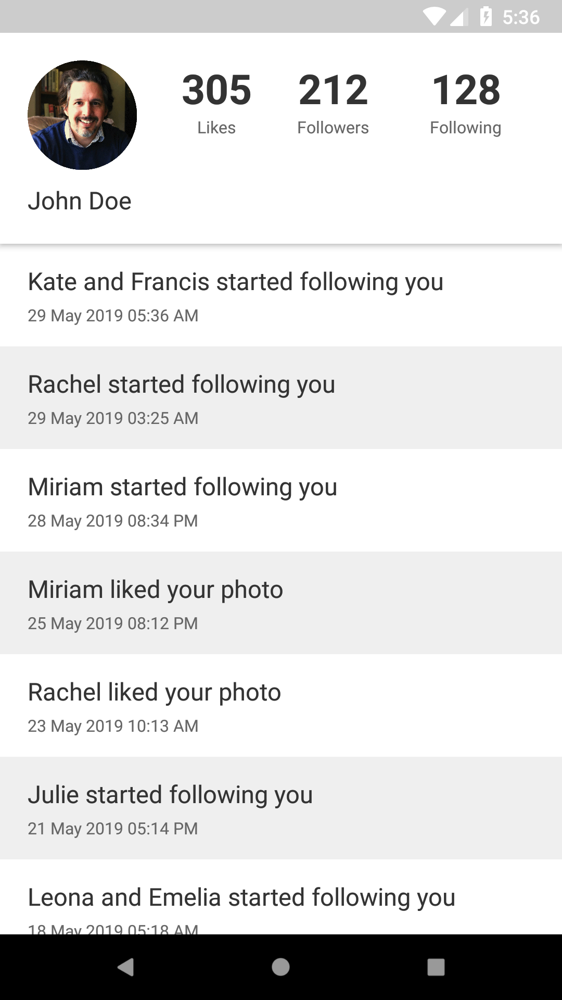
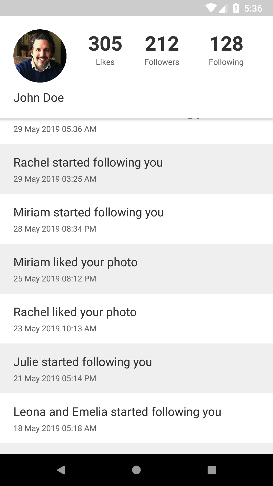
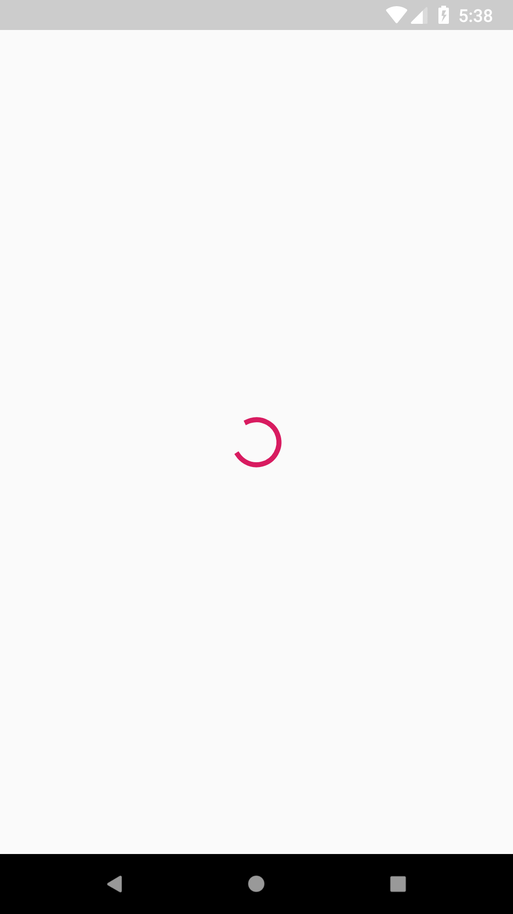
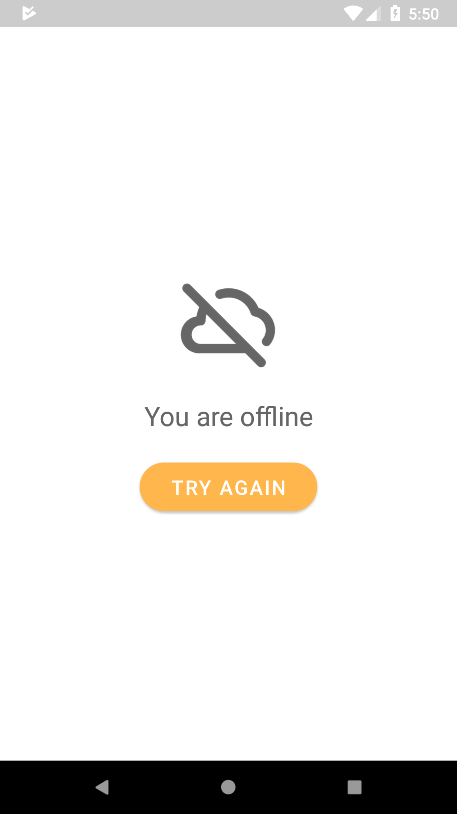

# Appsynth Android Assignment 

## (11 December 2019, 20:31:00)
## Confidental
Please don't disclose this assignment with anyone. 

## Story and Goals
We plan to launch a social photo sharing app. Your responsibility is to create the project's base structure and start the first user profile screen. It's going to be a long term project so the structure should be flexible, easy to understand and easy to be supported by your team members. Since we are making a high-quality application, we should handle all possible cases properly (no internet connection, showing loading progress)

## Your task
Your task is to create the user profile screen. The top section shows the profile information and the bottom part shows the user notifications list. Before you get the response from API, you need to show the loading progress. In case of any connection issue, you need to show a no connection screen that includes the "no connection" image, message and "try again" button. By clicking on "try again" button, it will load the data again.

The app should support both landscape and portrait modes. You can use the screenshots below as a reference.

**[Important]** Your final UI can look different, but it should include the same information as on the screenshots.



 

## API details

To get the user profile information, please use 
```
GET https://testapi.io/api/razir/user/profile
```

To get the user notifications list, please use
```
GET https://testapi.io/api/razir/users/{userId}/notifications
```

```{userId}``` you can find in the user profile API response

## Code requirements
 * The app must be written in Kotlin only
 * We prefer MVVM architecture, but you can use MVP or MVI
 * We prefer to use a dependency injection framework
 * We prefer scalable, maintainable and testable code
 * Having Unit tests would be a plus but not required
 * Having database cache would be a plus but not required
  
## Submission process
  You can use this repository while you are developing the app. 
  
  To submit the test assignment please **close the issue "Assignment Done" in "issues" tab**.
  
  We will review the code **only after you close "Assignment Done" issue**.

